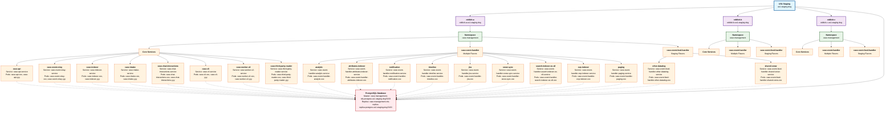

# US1 Staging Infrastructure

```mermaid
graph TD
    US1S["`**US1 Staging**
    us1.staging.dog`"]
    
    %% Clusters
    US1S --> OC1["`**oddish-a**
    oddish-a.us1.staging.dog`"]
    US1S --> OC2["`**oddish-b**
    oddish-b.us1.staging.dog`"]
    US1S --> OC3["`**oddish-c**
    oddish-c.us1.staging.dog`"]
    
    %% Database (shared)
    US1S --> DB["`**PostgreSQL Database**
    Master: case-management-rds.postgres.us1.staging.dog:5433
    Replica: case-management-rds-replica-replica.postgres.us1.staging.dog:5433`"]
    
    %% Namespace for each cluster
    OC1 --> NS1["`**Namespace**
    case-management`"]
    OC2 --> NS2["`**Namespace**
    case-management`"]
    OC3 --> NS3["`**Namespace**
    case-management`"]
    
    %% Core Services (on all clusters)
    NS1 --> CS1A["`**Core Services**`"]
    NS2 --> CS1B["`**Core Services**`"]
    NS3 --> CS1C["`**Core Services**`"]
    
    %% Service details for oddish-a
    CS1A --> API1["`**case-api**
    Service: case-api-service
    Pods: case-api-xxx, case-api-yyy`"]
    CS1A --> REL1["`**case-event-relay**
    Service: case-event-relay-service
    Pods: case-event-relay-xxx, case-event-relay-yyy`"]
    CS1A --> IDX1["`**case-indexer**
    Service: case-indexer-service
    Pods: case-indexer-xxx, case-indexer-yyy`"]
    CS1A --> INT1["`**case-intake**
    Service: case-intake-service
    Pods: case-intake-xxx, case-intake-yyy`"]
    CS1A --> CHAT1["`**case-chat-interactions**
    Service: case-chat-interactions-service
    Pods: case-chat-interactions-xxx, case-chat-interactions-yyy`"]
    CS1A --> CLI1["`**case-cli**
    Service: case-cli-service
    Pods: case-cli-xxx, case-cli-yyy`"]
    CS1A --> WORK1["`**case-worker-v2**
    Service: case-worker-v2-service
    Pods: case-worker-v2-xxx, case-worker-v2-yyy`"]
    CS1A --> TPR1["`**case-third-party-reader**
    Service: case-third-party-reader-service
    Pods: case-third-party-reader-xxx, case-third-party-reader-yyy`"]
    
    %% Event Handler Services (with flavors)
    NS1 --> EH1["`**case-event-handler**
    Multiple Flavors`"]
    NS2 --> EH2["`**case-event-handler**
    Multiple Flavors`"]
    NS3 --> EH3["`**case-event-handler**
    Multiple Flavors`"]
    
    EH1 --> ANAL1["`**analytic**
    Service: case-event-handler-analytic-service
    Pods: case-event-handler-analytic-xxx`"]
    EH1 --> ATTR1["`**attributes-indexer**
    Service: case-event-handler-attributes-indexer-service
    Pods: case-event-handler-attributes-indexer-xxx`"]
    EH1 --> NOTIF1["`**notification**
    Service: case-event-handler-notification-service
    Pods: case-event-handler-notification-xxx`"]
    EH1 --> TIME1["`**timeline**
    Service: case-event-handler-timeline-service
    Pods: case-event-handler-timeline-xxx`"]
    EH1 --> JIRA1["`**jira**
    Service: case-event-handler-jira-service
    Pods: case-event-handler-jira-xxx`"]
    EH1 --> SNOW1["`**snow-sync**
    Service: case-event-handler-snow-sync-service
    Pods: case-event-handler-snow-sync-xxx`"]
    EH1 --> ESIDX1["`**search-indexer-es-v8**
    Service: case-event-handler-search-indexer-es-v8-service
    Pods: case-event-handler-search-indexer-es-v8-xxx`"]
    EH1 --> EVP1["`**evp-indexer**
    Service: case-event-handler-evp-indexer-service
    Pods: case-event-handler-evp-indexer-xxx`"]
    EH1 --> PAGE1["`**paging**
    Service: case-event-handler-paging-service
    Pods: case-event-handler-paging-xxx`"]
    
    %% Feed Handler Services (Staging specific flavors)
    NS1 --> FH1["`**case-event-feed-handler**
    Staging Flavors`"]
    NS2 --> FH2["`**case-event-feed-handler**
    Staging Flavors`"]
    NS3 --> FH3["`**case-event-feed-handler**
    Staging Flavors`"]
    
    FH1 --> OTHER1["`**other-datadog**
    Service: case-event-feed-handler-other-datadog-service
    Pods: case-event-feed-handler-other-datadog-xxx`"]
    FH1 --> SNOW_SHARED1["`**shared-snow**
    Service: case-event-feed-handler-shared-snow-service
    Pods: case-event-feed-handler-shared-snow-xxx`"]
    
    %% Database connections (all services connect to shared DB)
    API1 -.-> DB
    REL1 -.-> DB
    IDX1 -.-> DB
    INT1 -.-> DB
    CHAT1 -.-> DB
    CLI1 -.-> DB
    WORK1 -.-> DB
    TPR1 -.-> DB
    ANAL1 -.-> DB
    ATTR1 -.-> DB
    NOTIF1 -.-> DB
    TIME1 -.-> DB
    JIRA1 -.-> DB
    SNOW1 -.-> DB
    ESIDX1 -.-> DB
    EVP1 -.-> DB
    PAGE1 -.-> DB
    OTHER1 -.-> DB
    SNOW_SHARED1 -.-> DB

    classDef datacenter fill:#e1f5fe,stroke:#01579b,stroke-width:3px,color:#000
    classDef cluster fill:#f3e5f5,stroke:#4a148c,stroke-width:2px,color:#000
    classDef namespace fill:#e8f5e8,stroke:#1b5e20,stroke-width:2px,color:#000
    classDef service fill:#fff3e0,stroke:#e65100,stroke-width:1px,color:#000
    classDef database fill:#ffebee,stroke:#b71c1c,stroke-width:2px,color:#000
    
    class US1S datacenter
    class OC1,OC2,OC3 cluster
    class NS1,NS2,NS3 namespace
    class CS1A,CS1B,CS1C,EH1,EH2,EH3,FH1,FH2,FH3 service
    class API1,REL1,IDX1,INT1,CHAT1,CLI1,WORK1,TPR1,ANAL1,ATTR1,NOTIF1,TIME1,JIRA1,SNOW1,ESIDX1,EVP1,PAGE1,OTHER1,SNOW_SHARED1 service
    class DB database
```