# Case Management Domain Architecture Report

## Overview

The Case Management domain at DataDog is a sophisticated, multi-tenant system designed to handle both incident management (OnCall) and general case/ticket management workflows. The architecture follows Domain-Driven Design (DDD) principles with a microservices approach, supporting real-time operations, extensive third-party integrations, and enterprise-scale deployment.

## Architecture Diagram

```mermaid
graph TB
    subgraph "External Systems"
        JIRA[JIRA]
        ServiceNow[ServiceNow]  
        Slack[Slack]
        DDEvents[DataDog Events]
        DDNotebooks[DataDog Notebooks]
    end

    subgraph "Client Applications"
        WebUI[Web UI]
        MobileApp[Mobile App]
        CLI[case-cli]
        ThirdParty[Third-party Apps]
    end

    subgraph "API Gateway Layer"
        CaseAPI[case-api<br/>gRPC Service]
        RapidAPI[case-rapid-api<br/>HTTP REST API]
        FileAPI[file-api<br/>File Management]
    end

    subgraph "Core Services"
        CaseIntake[case-intake<br/>Case Creation]
        EventHandler[case-event-handler<br/>Event Processing]
        EventRelay[case-event-relay<br/>Event Distribution]
        EventFeed[case-event-feed-handler<br/>External Event Feed]
        Indexer[case-indexer<br/>Search Indexing]
        Caseworker[caseworker<br/>Background Jobs]
        Synthetics[case-synthetics<br/>Testing & Orchestration]
        ChatInteractions[case-chat-interactions<br/>Slack Integration]
        ThirdPartyReader[case-third-party-reader<br/>External Data Reader]
    end

    subgraph "Domain Logic"
        CaseAggregate[Case Domain<br/>Core Business Logic]
        ProjectDomain[Project Domain<br/>Organization Logic]
        TimelineDomain[Timeline Domain<br/>Activity Tracking]
        AutomationDomain[Automation Domain<br/>Rule Engine]
        AttachmentDomain[Attachment Domain<br/>File Management]
        WatcherDomain[Watcher Domain<br/>Subscriptions]
        CustomAttrDomain[Custom Attributes<br/>Dynamic Fields]
        LinkDomain[Link Domain<br/>Case Relationships]
    end

    subgraph "Data Layer"
        PostgreSQL[(PostgreSQL<br/>Primary Database)]
        Elasticsearch[(Elasticsearch<br/>Search & Analytics)]
        FileStorage[(File Storage<br/>Attachments)]
    end

    subgraph "Infrastructure"
        Kubernetes[Kubernetes<br/>Container Orchestration]
        Helm[Helm Charts<br/>Deployment]
        Nexus[Nexus<br/>Real-time Notifications]
        AAA[AAA<br/>Authentication]
        OrgStore[OrgStore<br/>Organization Mgmt]
    end

    subgraph "Multi-Tenant Support"
        OnCallTenant[OnCall Tenant<br/>Incident Management]
        CaseMgmtTenant[Case Management Tenant<br/>General Cases]
    end

    %% External connections
    JIRA --> ThirdPartyReader
    ServiceNow --> ThirdPartyReader
    Slack --> ChatInteractions
    DDEvents --> EventFeed
    DDNotebooks --> CaseAPI

    %% Client connections
    WebUI --> CaseAPI
    WebUI --> RapidAPI
    MobileApp --> RapidAPI
    CLI --> CaseAPI
    ThirdParty --> RapidAPI

    %% API Gateway to Services
    CaseAPI --> CaseIntake
    CaseAPI --> EventHandler
    CaseAPI --> Caseworker
    RapidAPI --> CaseAPI
    FileAPI --> AttachmentDomain

    %% Service interconnections
    CaseIntake --> EventRelay
    EventHandler --> EventRelay
    EventRelay --> Indexer
    EventFeed --> EventHandler
    ThirdPartyReader --> EventHandler
    ChatInteractions --> EventHandler
    Synthetics --> CaseAPI

    %% Domain to Data
    CaseAggregate --> PostgreSQL
    ProjectDomain --> PostgreSQL
    TimelineDomain --> PostgreSQL
    AutomationDomain --> PostgreSQL
    AttachmentDomain --> FileStorage
    WatcherDomain --> PostgreSQL
    CustomAttrDomain --> PostgreSQL
    LinkDomain --> PostgreSQL

    %% Search and Analytics
    Indexer --> Elasticsearch
    CaseAPI --> Elasticsearch

    %% Infrastructure connections
    CaseAPI --> AAA
    CaseAPI --> OrgStore
    EventRelay --> Nexus
    CaseAPI --> OnCallTenant
    CaseAPI --> CaseMgmtTenant

    %% Styling
    classDef external fill:#ffcccc
    classDef api fill:#ccffcc
    classDef service fill:#ccccff
    classDef domain fill:#ffffcc
    classDef data fill:#ffccff
    classDef infra fill:#ccffff

    class JIRA,ServiceNow,Slack,DDEvents,DDNotebooks external
    class CaseAPI,RapidAPI,FileAPI api
    class CaseIntake,EventHandler,EventRelay,EventFeed,Indexer,Caseworker,Synthetics,ChatInteractions,ThirdPartyReader service
    class CaseAggregate,ProjectDomain,TimelineDomain,AutomationDomain,AttachmentDomain,WatcherDomain,CustomAttrDomain,LinkDomain domain
    class PostgreSQL,Elasticsearch,FileStorage data
    class Kubernetes,Helm,Nexus,AAA,OrgStore,OnCallTenant,CaseMgmtTenant infra
```

## Service Descriptions

### API Gateway Layer

#### case-api (gRPC Service)
- **Location**: `domains/case_management/apps/case-api/`
- **Purpose**: Primary gRPC API service providing the main interface for all case management operations
- **Key Features**:
  - Multi-tenant support (OnCall and Case Management)
  - Full CRUD operations for cases, projects, and related entities
  - Real-time event streaming
  - Authentication and authorization integration
- **Proto Definitions**: Comprehensive gRPC service definitions in `proto/` directory

#### case-rapid-api (HTTP REST API)
- **Location**: `domains/case_management/apps/apis/case-rapid-api/`
- **Purpose**: HTTP REST API for external integrations and web applications
- **Key Features**:
  - RESTful endpoints mirroring gRPC functionality
  - JSON request/response format
  - External system integration support
  - Rate limiting and authentication

#### file-api (File Management Service)
- **Location**: `domains/case_management/apps/apis/file-api/`
- **Purpose**: Dedicated service for handling file attachments
- **Key Features**:
  - File upload/download operations
  - Metadata management
  - Security scanning
  - Storage abstraction layer

### Core Processing Services

#### case-intake (Case Creation Service)
- **Location**: `domains/case_management/apps/case-intake/`
- **Purpose**: Handles new case creation and initial processing
- **Key Features**:
  - Input validation and sanitization
  - Case type routing
  - Initial enrichment
  - Event generation for new cases

#### case-event-handler (Event Processing Engine)
- **Location**: `domains/case_management/apps/case-event-handler/`
- **Purpose**: Central event processing engine for all case-related events
- **Key Features**:
  - Event sourcing implementation
  - State transition validation
  - Business rule enforcement
  - Timeline generation

#### case-event-relay (Event Distribution Service)
- **Location**: `domains/case_management/apps/case-event-relay/`
- **Purpose**: Distributes events to various consumers and external systems
- **Key Features**:
  - Pub/sub pattern implementation
  - Event routing based on rules
  - Guaranteed delivery mechanisms
  - Integration with Nexus for real-time notifications

#### case-indexer (Search Indexing Service)
- **Location**: `domains/case_management/apps/case-indexer/`
- **Purpose**: Maintains Elasticsearch indices for case search and analytics
- **Key Features**:
  - Real-time index updates
  - Bulk indexing operations
  - Search optimization
  - Analytics data preparation

#### caseworker (Background Job Service)
- **Location**: `domains/case_management/apps/caseworker/`
- **Purpose**: Handles asynchronous background operations
- **Key Features**:
  - Scheduled task execution
  - Bulk operations processing
  - Data cleanup and maintenance
  - Report generation

### Integration Services

#### case-third-party-reader (External System Integration)
- **Location**: `domains/case_management/apps/case-third-party-reader/`
- **Purpose**: Reads data from external systems like JIRA and ServiceNow
- **Key Features**:
  - Bi-directional synchronization
  - Data transformation and mapping
  - Conflict resolution
  - Rate limiting for external APIs

#### case-chat-interactions (Slack Integration)
- **Location**: `domains/case_management/apps/case-chat-interactions/`
- **Purpose**: Provides Slack integration for case management workflows
- **Key Features**:
  - Slack bot functionality
  - Interactive case creation/updates
  - Notification management
  - Slash command support

#### case-synthetics (Testing & Orchestration)
- **Location**: `domains/case_management/apps/case-synthetics/`
- **Purpose**: Synthetic testing and service orchestration
- **Key Features**:
  - End-to-end testing
  - Service health monitoring
  - Workflow orchestration
  - Performance testing

### Domain Logic Layer

#### Case Domain (Core Aggregate)
- **Location**: `domains/case_management/libs/casem/`
- **Purpose**: Core business logic for case management
- **Key Entities**:
  - Case aggregate root
  - Case status and lifecycle management
  - Priority and escalation logic
  - Assignment and routing rules

#### Project Domain
- **Location**: `domains/case_management/libs/project/`
- **Purpose**: Project organization and management
- **Key Features**:
  - Project hierarchy management
  - Team and user assignments
  - Project-level configurations
  - Favorites and preferences

#### Timeline Domain
- **Location**: `domains/case_management/libs/timeline/`
- **Purpose**: Case activity tracking and timeline management
- **Key Features**:
  - Activity logging
  - Comment and update tracking
  - Timeline visualization
  - Activity filtering and search

#### Automation Domain
- **Location**: `domains/case_management/libs/automation/`
- **Purpose**: Business rule engine and workflow automation
- **Key Features**:
  - Rule definition and execution
  - Trigger-based automation
  - Workflow orchestration
  - SLA management

### Data Layer

#### PostgreSQL Database
- **Primary Storage**: Main transactional database for all case management data
- **Key Tables**:
  - `case`: Core case entity with full audit trail
  - `project`: Project organization structure
  - `timeline_cell`: Activity and timeline entries
  - `automation_rule`: Business automation rules
  - `custom_attribute`: Dynamic field definitions
  - `case_link`: Case relationship mapping
- **Migration Management**: 132+ migrations showing system evolution

#### Elasticsearch Cluster
- **Search Engine**: Full-text search and analytics platform
- **Key Indices**:
  - Case search index with faceted search
  - Analytics aggregation data
  - Auto-complete suggestions
- **Features**:
  - Real-time search capabilities
  - Advanced filtering and faceting
  - Analytics and reporting queries

### Multi-Tenant Architecture

#### OnCall Tenant
- **Purpose**: Incident management and emergency response
- **Key Features**:
  - Rapid case creation from alerts
  - Integration with DataDog monitoring
  - Escalation procedures
  - On-call rotation management

#### Case Management Tenant
- **Purpose**: General case and ticket management
- **Key Features**:
  - Flexible case types and workflows
  - Customer service integration
  - SLA tracking
  - Custom field management

## Deployment Architecture

### Kubernetes Infrastructure
- **Multi-datacenter deployment**: ap1, ap2, eu1, us1, us3, us5
- **Helm-based deployments**: Standardized configuration management
- **Auto-scaling**: Horizontal pod autoscaling based on metrics
- **Service mesh**: Inter-service communication and observability

### Configuration Management
- **Environment-specific configurations**: Staging and production variants
- **Tenant-specific settings**: Isolated configurations per tenant
- **Feature flags**: Runtime behavior modification
- **Secret management**: Secure credential handling

## Key Integrations

### External Systems
1. **JIRA**: Bi-directional issue synchronization
2. **ServiceNow**: Service management integration
3. **Slack**: Real-time notifications and interactive workflows
4. **DataDog Events**: Event correlation and enrichment
5. **DataDog Notebooks**: Investigation workflow integration

### Internal DataDog Services
1. **AAA (Authentication, Authorization, Accounting)**: User management
2. **OrgStore**: Organization and account management
3. **OUI (Org User Info)**: User profile and preference service
4. **Nexus**: Real-time notification delivery
5. **OnCall**: PagerDuty-style incident management

## Technical Highlights

### Event-Driven Architecture
- **Event Sourcing**: Complete audit trail of all case changes
- **CQRS Pattern**: Separation of command and query responsibilities
- **Real-time Processing**: Immediate event propagation and processing
- **Event Replay**: Ability to rebuild state from events

### Scalability Features
- **Horizontal Scaling**: Stateless services with load balancing
- **Database Sharding**: Tenant-based data isolation
- **Caching Strategies**: Multi-level caching for performance
- **Async Processing**: Background job queues for heavy operations

### Security and Compliance
- **Multi-tenant Isolation**: Secure data separation
- **Role-based Access Control**: Granular permission management
- **Audit Logging**: Complete operation tracking
- **Data Encryption**: At-rest and in-transit encryption

## Development and Operations

### Development Tools
- **CLI Interface**: `case-cli` for administrative operations
- **Local Development**: Tilt-based development environment
- **Testing**: Comprehensive unit and integration test suites
- **API Documentation**: Auto-generated from Protocol Buffer definitions

### Monitoring and Observability
- **Metrics Collection**: Prometheus-based metrics
- **Distributed Tracing**: Full request tracing across services
- **Log Aggregation**: Centralized logging with structured data
- **Health Checks**: Service health monitoring and alerting

This architecture represents a mature, enterprise-grade case management platform capable of handling high-volume, mission-critical operations while maintaining flexibility for diverse use cases and integration requirements.