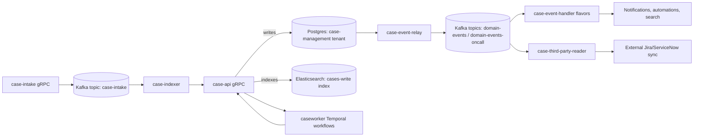
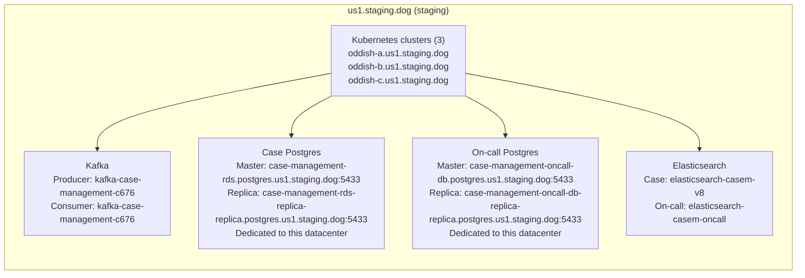
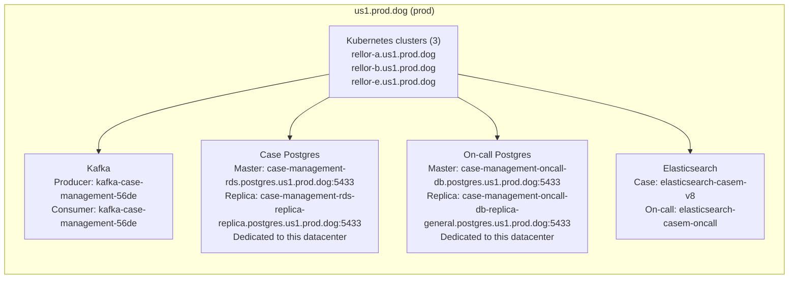
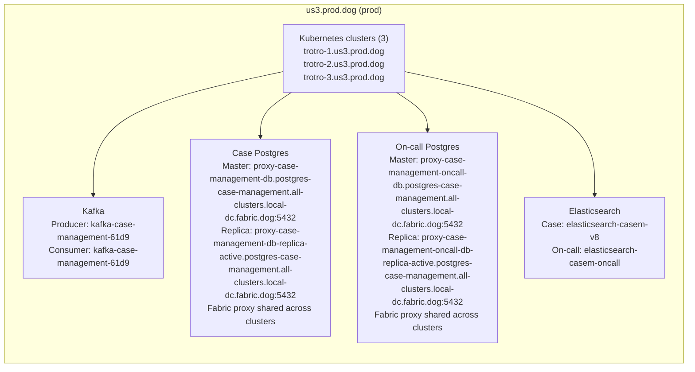
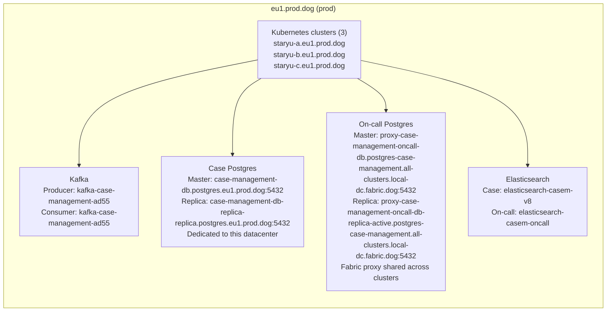
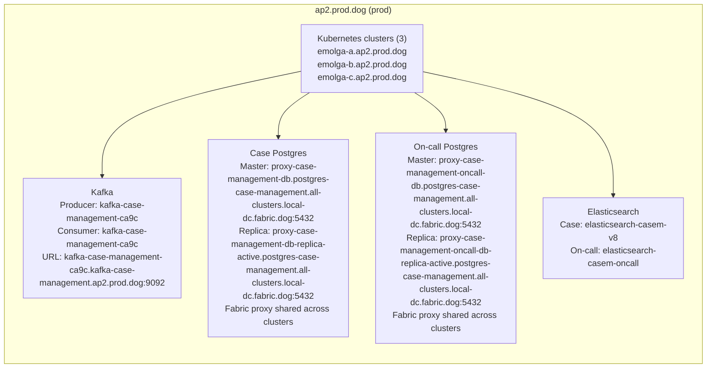
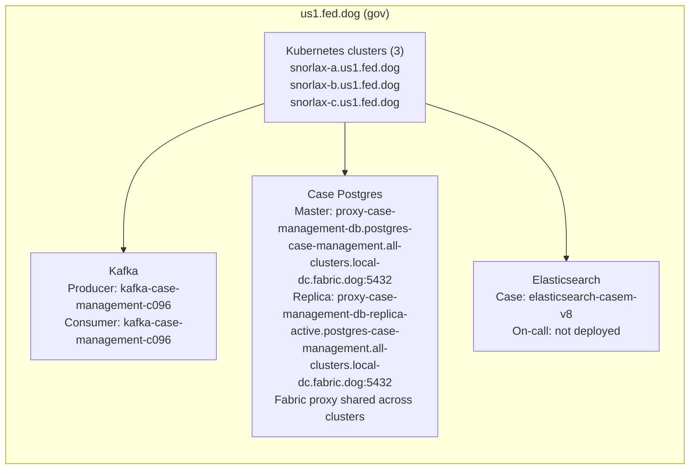

# Case Management Infrastructure Report

_Generated on 2025-10-16 08:54:56 UTC_

## Architecture Overview
The Case Management domain stitches together gRPC services, Kafka pipelines, Temporal workers, and multi-tenant datastores to collect, enrich, and disseminate case data. Requests land on regional gRPC frontends, are persisted in Postgres, indexed in Elasticsearch, and fanned out through Kafka so domain-specific handlers can execute automation and third-party synchronization.

## Network Data Flow

## Messaging Footprint
The domain currently relies on the following Kafka topics. Consumer counts include dedicated consumer groups for each case-event-handler flavor and third-party reader variant.

| Topic | Producers | Consumers | Notes |
| --- | --- | --- | --- |
| case-intake | case-intake | case-indexer | Primary ingress topic for case creation events |
| collaboration_integrations_jira | - | case-third-party-reader (jira) consumer-group:case-management | Processed by case-third-party-reader flavor 'jira' |
| collaboration_integrations_servicenow | - | case-third-party-reader (servicenow) consumer-group:case-management | Processed by case-third-party-reader flavor 'servicenow' |
| domain-events | case-event-relay (case-management) | case-event-handler (case-management) | Domain event fan-out topics used by downstream handlers (handled by 17 case-event-handler flavors) |
| domain-events-oncall | case-event-relay (on-call) | case-event-handler (on-call) | Domain event fan-out topics used by downstream handlers (handled by 17 case-event-handler flavors) |

## Datacenter Footprint Summary
Each datacenter runs identical Helm charts but differs in Kafka broker IDs, database endpoints, and whether on-call tenant workloads are colocated.

| Datacenter | Environment | Kubernetes clusters | Kafka clusters | Case Postgres | On-call Postgres | Elasticsearch |
| --- | --- | --- | --- | --- | --- | --- |
| us1.staging.dog | staging | 3 clusters oddish-a.us1.staging.dog oddish-b.us1.staging.dog oddish-c.us1.staging.dog | producer: kafka-case-management-c676 | master: case-management-rds.postgres.us1.staging.dog:5433 replica: case-management-rds-replica-replica.postgres.us1.staging.dog:5433 Dedicated to this datacenter | master: case-management-oncall-db.postgres.us1.staging.dog:5433 replica: case-management-oncall-db-replica-replica.postgres.us1.staging.dog:5433 Dedicated to this datacenter | case: elasticsearch-casem-v8 on-call: elasticsearch-casem-oncall |
| us1.prod.dog | prod | 3 clusters rellor-a.us1.prod.dog rellor-b.us1.prod.dog rellor-e.us1.prod.dog | producer: kafka-case-management-56de | master: case-management-rds.postgres.us1.prod.dog:5433 replica: case-management-rds-replica-replica.postgres.us1.prod.dog:5433 Dedicated to this datacenter | master: case-management-oncall-db.postgres.us1.prod.dog:5433 replica: case-management-oncall-db-replica-general.postgres.us1.prod.dog:5433 Dedicated to this datacenter | case: elasticsearch-casem-v8 on-call: elasticsearch-casem-oncall |
| us3.prod.dog | prod | 3 clusters trotro-1.us3.prod.dog trotro-2.us3.prod.dog trotro-3.us3.prod.dog | producer: kafka-case-management-61d9 | master: proxy-case-management-db.postgres-case-management.all-clusters.local-dc.fabric.dog:5432 replica: proxy-case-management-db-replica-active.postgres-case-management.all-clusters.local-dc.fabric.dog:5432 Fabric proxy shared across clusters | master: proxy-case-management-oncall-db.postgres-case-management.all-clusters.local-dc.fabric.dog:5432 replica: proxy-case-management-oncall-db-replica-active.postgres-case-management.all-clusters.local-dc.fabric.dog:5432 Fabric proxy shared across clusters | case: elasticsearch-casem-v8 on-call: elasticsearch-casem-oncall |
| us5.prod.dog | prod | 3 clusters zorua-a.us5.prod.dog zorua-c.us5.prod.dog zorua-f.us5.prod.dog | producer: kafka-case-management-0e5e | master: case-management-db.postgres.us5.prod.dog:5432 replica: case-management-db-replica-replica.postgres.us5.prod.dog:5432 Dedicated to this datacenter | master: proxy-case-management-oncall-db.postgres-case-management.all-clusters.local-dc.fabric.dog:5432 replica: proxy-case-management-oncall-db-replica-active.postgres-case-management.all-clusters.local-dc.fabric.dog:5432 Fabric proxy shared across clusters | case: elasticsearch-casem-v8 on-call: elasticsearch-casem-oncall |
| eu1.prod.dog | prod | 3 clusters staryu-a.eu1.prod.dog staryu-b.eu1.prod.dog staryu-c.eu1.prod.dog | producer: kafka-case-management-ad55 | master: case-management-db.postgres.eu1.prod.dog:5432 replica: case-management-db-replica-replica.postgres.eu1.prod.dog:5432 Dedicated to this datacenter | master: proxy-case-management-oncall-db.postgres-case-management.all-clusters.local-dc.fabric.dog:5432 replica: proxy-case-management-oncall-db-replica-active.postgres-case-management.all-clusters.local-dc.fabric.dog:5432 Fabric proxy shared across clusters | case: elasticsearch-casem-v8 on-call: elasticsearch-casem-oncall |
| ap1.prod.dog | prod | 3 clusters brionne-a.ap1.prod.dog brionne-c.ap1.prod.dog brionne-d.ap1.prod.dog | producer: kafka-case-management-6609 | master: proxy-case-management-db.postgres-case-management.all-clusters.local-dc.fabric.dog:5432 replica: proxy-case-management-db-replica-active.postgres-case-management.all-clusters.local-dc.fabric.dog:5432 Fabric proxy shared across clusters | master: proxy-case-management-oncall-db.postgres-case-management.all-clusters.local-dc.fabric.dog:5432 replica: proxy-case-management-oncall-db-replica-active.postgres-case-management.all-clusters.local-dc.fabric.dog:5432 Fabric proxy shared across clusters | case: elasticsearch-casem-v8 on-call: elasticsearch-casem-oncall |
| ap2.prod.dog | prod | 3 clusters emolga-a.ap2.prod.dog emolga-b.ap2.prod.dog emolga-c.ap2.prod.dog | producer: kafka-case-management-ca9c url: kafka-case-management-ca9c.kafka-case-management.ap2.prod.dog:9092 | master: proxy-case-management-db.postgres-case-management.all-clusters.local-dc.fabric.dog:5432 replica: proxy-case-management-db-replica-active.postgres-case-management.all-clusters.local-dc.fabric.dog:5432 Fabric proxy shared across clusters | master: proxy-case-management-oncall-db.postgres-case-management.all-clusters.local-dc.fabric.dog:5432 replica: proxy-case-management-oncall-db-replica-active.postgres-case-management.all-clusters.local-dc.fabric.dog:5432 Fabric proxy shared across clusters | case: elasticsearch-casem-v8 on-call: elasticsearch-casem-oncall |
| us1.fed.dog | gov | 3 clusters snorlax-a.us1.fed.dog snorlax-b.us1.fed.dog snorlax-c.us1.fed.dog | producer: kafka-case-management-c096 | master: proxy-case-management-db.postgres-case-management.all-clusters.local-dc.fabric.dog:5432 replica: proxy-case-management-db-replica-active.postgres-case-management.all-clusters.local-dc.fabric.dog:5432 Fabric proxy shared across clusters | Not deployed | case: elasticsearch-casem-v8 on-call: not deployed |

## Datacenter Topology Diagrams
### us1.staging.dog (staging)

### us1.prod.dog (prod)

### us3.prod.dog (prod)

### us5.prod.dog (prod)

### eu1.prod.dog (prod)

### ap1.prod.dog (prod)

### ap2.prod.dog (prod)

### us1.fed.dog (gov)

## Per-datacenter Deployment Notes
### us1.staging.dog
*Environment*: staging

* Kubernetes clusters: oddish-a.us1.staging.dog, oddish-b.us1.staging.dog, oddish-c.us1.staging.dog
* Kafka: producer cluster `kafka-case-management-c676`, consumer cluster `kafka-case-management-c676`
* Case Postgres: master `case-management-rds.postgres.us1.staging.dog:5433`, replica `case-management-rds-replica-replica.postgres.us1.staging.dog:5433`, Dedicated to this datacenter
* On-call Postgres: master `case-management-oncall-db.postgres.us1.staging.dog:5433`, replica `case-management-oncall-db-replica-replica.postgres.us1.staging.dog:5433`, Dedicated to this datacenter
* Features: DD dynamic instrumentation enabled

### us1.prod.dog
*Environment*: prod

* Kubernetes clusters: rellor-a.us1.prod.dog, rellor-b.us1.prod.dog, rellor-e.us1.prod.dog
* Kafka: producer cluster `kafka-case-management-56de`, consumer cluster `kafka-case-management-56de`
* Case Postgres: master `case-management-rds.postgres.us1.prod.dog:5433`, replica `case-management-rds-replica-replica.postgres.us1.prod.dog:5433`, Dedicated to this datacenter
* On-call Postgres: master `case-management-oncall-db.postgres.us1.prod.dog:5433`, replica `case-management-oncall-db-replica-general.postgres.us1.prod.dog:5433`, Dedicated to this datacenter

### us3.prod.dog
*Environment*: prod

* Kubernetes clusters: trotro-1.us3.prod.dog, trotro-2.us3.prod.dog, trotro-3.us3.prod.dog
* Kafka: producer cluster `kafka-case-management-61d9`, consumer cluster `kafka-case-management-61d9`
* Case Postgres: master `proxy-case-management-db.postgres-case-management.all-clusters.local-dc.fabric.dog:5432`, replica `proxy-case-management-db-replica-active.postgres-case-management.all-clusters.local-dc.fabric.dog:5432`, Fabric proxy shared across clusters
* On-call Postgres: master `proxy-case-management-oncall-db.postgres-case-management.all-clusters.local-dc.fabric.dog:5432`, replica `proxy-case-management-oncall-db-replica-active.postgres-case-management.all-clusters.local-dc.fabric.dog:5432`, Fabric proxy shared across clusters

### us5.prod.dog
*Environment*: prod

* Kubernetes clusters: zorua-a.us5.prod.dog, zorua-c.us5.prod.dog, zorua-f.us5.prod.dog
* Kafka: producer cluster `kafka-case-management-0e5e`, consumer cluster `kafka-case-management-0e5e`
* Case Postgres: master `case-management-db.postgres.us5.prod.dog:5432`, replica `case-management-db-replica-replica.postgres.us5.prod.dog:5432`, Dedicated to this datacenter
* On-call Postgres: master `proxy-case-management-oncall-db.postgres-case-management.all-clusters.local-dc.fabric.dog:5432`, replica `proxy-case-management-oncall-db-replica-active.postgres-case-management.all-clusters.local-dc.fabric.dog:5432`, Fabric proxy shared across clusters

### eu1.prod.dog
*Environment*: prod

* Kubernetes clusters: staryu-a.eu1.prod.dog, staryu-b.eu1.prod.dog, staryu-c.eu1.prod.dog
* Kafka: producer cluster `kafka-case-management-ad55`, consumer cluster `kafka-case-management-ad55`
* Case Postgres: master `case-management-db.postgres.eu1.prod.dog:5432`, replica `case-management-db-replica-replica.postgres.eu1.prod.dog:5432`, Dedicated to this datacenter
* On-call Postgres: master `proxy-case-management-oncall-db.postgres-case-management.all-clusters.local-dc.fabric.dog:5432`, replica `proxy-case-management-oncall-db-replica-active.postgres-case-management.all-clusters.local-dc.fabric.dog:5432`, Fabric proxy shared across clusters

### ap1.prod.dog
*Environment*: prod

* Kubernetes clusters: brionne-a.ap1.prod.dog, brionne-c.ap1.prod.dog, brionne-d.ap1.prod.dog
* Kafka: producer cluster `kafka-case-management-6609`, consumer cluster `kafka-case-management-6609`
* Case Postgres: master `proxy-case-management-db.postgres-case-management.all-clusters.local-dc.fabric.dog:5432`, replica `proxy-case-management-db-replica-active.postgres-case-management.all-clusters.local-dc.fabric.dog:5432`, Fabric proxy shared across clusters
* On-call Postgres: master `proxy-case-management-oncall-db.postgres-case-management.all-clusters.local-dc.fabric.dog:5432`, replica `proxy-case-management-oncall-db-replica-active.postgres-case-management.all-clusters.local-dc.fabric.dog:5432`, Fabric proxy shared across clusters

### ap2.prod.dog
*Environment*: prod

* Kubernetes clusters: emolga-a.ap2.prod.dog, emolga-b.ap2.prod.dog, emolga-c.ap2.prod.dog
* Kafka: producer cluster `kafka-case-management-ca9c`, consumer cluster `kafka-case-management-ca9c`, brokers reachable at `kafka-case-management-ca9c.kafka-case-management.ap2.prod.dog:9092`
* Case Postgres: master `proxy-case-management-db.postgres-case-management.all-clusters.local-dc.fabric.dog:5432`, replica `proxy-case-management-db-replica-active.postgres-case-management.all-clusters.local-dc.fabric.dog:5432`, Fabric proxy shared across clusters
* On-call Postgres: master `proxy-case-management-oncall-db.postgres-case-management.all-clusters.local-dc.fabric.dog:5432`, replica `proxy-case-management-oncall-db-replica-active.postgres-case-management.all-clusters.local-dc.fabric.dog:5432`, Fabric proxy shared across clusters

### us1.fed.dog
*Environment*: gov

* Kubernetes clusters: snorlax-a.us1.fed.dog, snorlax-b.us1.fed.dog, snorlax-c.us1.fed.dog
* Kafka: producer cluster `kafka-case-management-c096`, consumer cluster `kafka-case-management-c096`
* Case Postgres: master `proxy-case-management-db.postgres-case-management.all-clusters.local-dc.fabric.dog:5432`, replica `proxy-case-management-db-replica-active.postgres-case-management.all-clusters.local-dc.fabric.dog:5432`, Fabric proxy shared across clusters
* On-call Postgres: tenant not deployed in this datacenter

## Service Responsibilities
### case-intake
*Type*: gRPC ingress + Kafka producer
Accepts authenticated intake requests, performs validation, and publishes canonical case payloads to the `case-intake` topic for asynchronous processing.

### case-indexer
*Type*: Kafka consumer + search index writer
Consumes from `case-intake`, enriches payloads by calling `case-api`, and ensures Elasticsearch indexes stay in sync so new cases are searchable immediately.

### case-api
*Type*: Multi-tenant gRPC API
Coordinates Postgres transactions, search index updates, notification rule evaluation, and outbound integration hooks for the domain.

### case-event-relay
*Type*: Postgres change poller + Kafka producer
Polls the `domain_events` tables, batches new records, and publishes them to tenant-specific Kafka topics to decouple persistence from automation workloads.

### case-event-handler
*Type*: Kafka consumer with 17 flavors
Each flavor has an isolated consumer group that processes a subset of domain events (analytics, search indexing, notifications, rule evaluation, paging) while sharing the same topic stream.

### case-third-party-reader
*Type*: Kafka consumer
Consumes Jira and ServiceNow connector feeds so that external ticket updates can be reflected in Case Management timelines.

### caseworker
*Type*: Temporal worker
Executes long-running workflows (case cleanup, merge automation, file lifecycle tasks) and interacts with `case-api` and storage backends.

### case-chat-interactions
*Type*: gRPC service
Bridges chat integrations via Hermes to append conversation excerpts into case timelines and trigger follow-up automation.