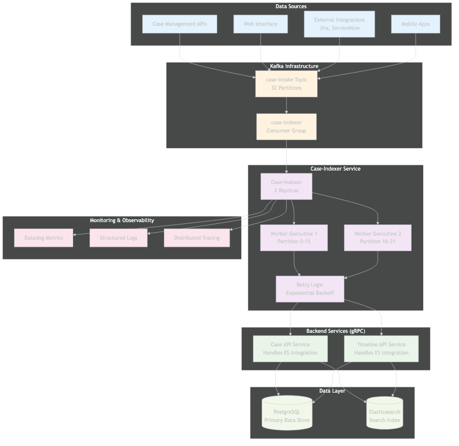

# Case-Indexer Service Technical Report (CORRECTED)

## Executive Summary

The Case-Indexer is a **Kafka-to-gRPC bridge service** in Datadog's case management domain that serves as an asynchronous message processor. It consumes events from the `case-intake` Kafka topic and routes them to appropriate backend services (case-api and timeline-api) via gRPC calls. **The service does NOT directly integrate with Elasticsearch** - all database and search operations are handled by the downstream gRPC services.

## Service Overview

### Primary Functions
1. **Kafka Consumer**: Processes messages from `case-intake` topic with 32 partitions
2. **Message Router**: Routes different request types to appropriate gRPC services
3. **Async Bridge**: Provides asynchronous processing for case management operations
4. **Error Handler**: Implements retry logic with exponential backoff and pod restart strategies

### Key Metrics
- **Topic**: `case-intake` with 32 partitions
- **Consumer Group**: `case-indexer`
- **Deployment**: 2 replicas per datacenter
- **Processing**: Up to 32 parallel workers (one per partition)
- **Request Types**: 4 main types routed via gRPC

## Architecture Overview

### System Architecture



The case-indexer follows a simple **message consumer and router pattern**:
- **Data Sources** publish to Kafka topic
- **Case-Indexer** consumes messages and makes gRPC calls
- **Backend Services** (case-api, timeline-api) handle all data persistence and Elasticsearch operations
- **case-indexer has NO direct database or Elasticsearch connections**

### Data Flow Architecture


**IMPORTANT**: The case-indexer is purely a **Kafka→gRPC router**:
1. **Client Applications** publish requests to `case-intake` topic
2. **case-indexer** pulls messages and decodes protobuf payloads
3. **gRPC calls** to case-api or timeline-api services
4. **Backend services** handle PostgreSQL storage and Elasticsearch indexing
5. **case-indexer** only handles acknowledgment and error retry logic

## Event Processing Pipeline

### Message Processing Flow


The processing pipeline is straightforward:
1. **Message Decoding**: Decode intake payload from Kafka
2. **Request Type Detection**: Determine which gRPC service to call
3. **gRPC Service Call**: Route to case-api or timeline-api
4. **Error Classification**: Handle gRPC response errors
5. **Retry Logic**: Exponential backoff or pod restart for failures

### Request Types and gRPC Routing

#### 1. CreateRequest (`*casepb.CreateRequest`)
- **gRPC Call**: `caseClient.Create(ctx, req)`
- **Backend**: case-api service handles PostgreSQL and Elasticsearch operations
- **case-indexer role**: Message routing only

#### 2. UpdateRequest (`*casepb.UpdateRequest`)
- **gRPC Call**: `caseClient.Update(ctx, req)`
- **Backend**: case-api service handles data updates and reindexing
- **case-indexer role**: Message routing only

#### 3. CreateCellRequest (`*timelinepb.CreateCellRequest`)
- **gRPC Call**: `timelineClient.CreateCell(ctx, req)`
- **Backend**: timeline-api service handles timeline storage and analytics updates
- **case-indexer role**: Message routing only

#### 4. IntegrationIncrementalSyncRequest (`*casepb.IntegrationIncrementalSyncRequest`)
- **gRPC Call**: `caseClient.IntegrationIncrementalSync(ctx, req)`
- **Backend**: case-api service handles integration data synchronization
- **case-indexer role**: Message routing only

## What case-indexer Does NOT Do

### No Direct Database Integration
- **No PostgreSQL connections**: All database operations via gRPC
- **No Elasticsearch client**: All search operations via case-api/timeline-api
- **No direct data manipulation**: Pure message routing service

### No Business Logic
- **No data transformation**: Passes protobuf messages as-is to gRPC services
- **No validation**: Relies on backend services for request validation
- **No caching**: Stateless message processor

### No Direct External Integrations
- **No Jira/ServiceNow clients**: Integration logic in backend services
- **No search APIs**: Search handled by case-api service
- **No analytics processing**: Analytics handled by timeline-api

## Actual Technical Implementation

### Core Components

#### Main Service (`main.go`)
```go
// Creates gRPC clients to backend services
caseAPI, err := newCaseAPI()  // case-api gRPC client
indexer, err := NewIndexer(caseAPI.CaseClient, caseAPI.TimelineClient, stopper)

// Consumes from Kafka by partition
chans, err := casemconsumer.ConsumeKafkaTopicByPartition[intakecodec.Payload](...)

// Runs parallel workers
for idx, c := range chans {
    go indexer.Run(c, idx)  // One goroutine per partition
}
```

#### Indexer Logic (`indexer.go`)
```go
func (i *CaseIndexer) handleRequest(ctx context.Context, r *intakecodec.Payload) error {
    switch req := r.RequestV2.(type) {
    case *casepb.CreateRequest:
        _, err = i.caseClient.Create(ctx, req)  // gRPC call only
    case *casepb.UpdateRequest:
        _, err = i.caseClient.Update(ctx, req)  // gRPC call only
    case *timelinepb.CreateCellRequest:
        _, err = i.timelineClient.CreateCell(ctx, req)  // gRPC call only
    case *casepb.IntegrationIncrementalSyncRequest:
        _, err = i.caseClient.IntegrationIncrementalSync(ctx, req)  // gRPC call only
    }
    return err
}
```

### Dependencies

#### Runtime Dependencies
- **Kafka**: Message broker for `case-intake` topic
- **case-api**: gRPC service for case operations
- **timeline-api**: gRPC service for timeline operations

#### No Direct Dependencies
- ❌ **PostgreSQL**: Connected via case-api/timeline-api only
- ❌ **Elasticsearch**: Connected via case-api/timeline-api only
- ❌ **External APIs**: All integrations via backend services

## Datacenter Deployment Strategy

### Multi-Environment Deployment


**Deployment Configuration (CORRECTED)**

#### Environment Differences
- **Staging**: `dangerous_everything_parallel` deployment, Monday 5:00 AM
- **Production**: `delta` deployment (DC-by-DC), Monday 8:30 AM  
- **Government**: `delta` deployment with FIPS images, Wednesday 8:30 AM

#### Resource Allocation (All Environments)
```yaml
resources:
  requests:
    cpu: 1 core
    memory: 1Gi
  limits:
    cpu: 1 core
    memory: 2Gi
replicas: 2  # Per datacenter
```

#### gRPC Configuration
- **Development**: `passthrough:///case-api:6481`
- **Production**: TLS-enabled service discovery
- **No database configuration**: All via gRPC

## Performance and Observability

### Key Metrics Collected

#### Processing Metrics
- `dd.case_indexer.latency` - Kafka message to gRPC response latency
- `dd.case_indexer.local_retries` - gRPC retry attempts
- `dd.case_indexer.retries` - Pod restart counts for persistent gRPC failures
- `dd.case_indexer.skipped_requests` - Skipped messages by reason
- `dd.case_indexer.error` - gRPC error rates by type and retryability

#### Business Metrics
- **Message throughput** by Kafka partition
- **gRPC call success/failure rates** by service
- **Processing latency** from Kafka to gRPC completion
- **Duplicate detection** via gRPC status codes

### Error Handling Strategy

#### Three-Tier Error Handling
1. **Local Retries**: Exponential backoff for transient gRPC failures
2. **Pod Restart**: Fatal restart when gRPC services persistently unavailable
3. **Message Skipping**: Skip malformed messages or duplicates (AlreadyExists)

#### Error Classification
```go
func isDuplicate(err error) bool {
    if st, ok := status.FromError(err); ok {
        return st.Code() == codes.AlreadyExists  // gRPC status code
    }
    return false
}
```

### Health Monitoring

#### Health Checks
- **Liveness**: `/liveness` on port 8080 - service running
- **Readiness**: `/readiness` on port 8080 - ready to process messages
- **No database health checks**: Service is stateless gRPC router

## Security and Configuration

### Security Features
- **gRPC TLS**: All service-to-service communication encrypted
- **Service Account**: case-management shared RBAC
- **Network Policies**: Cilium-based service isolation
- **No direct database access**: Security handled by backend services

### Configuration Management
- **Consul-based**: Dynamic gRPC endpoint configuration
- **Environment-specific**: Dev vs prod gRPC targets
- **No database config**: No connection strings or credentials

## Integration Architecture

### Upstream (Kafka)
- **case-intake Topic**: 32 partitions
- **Consumer Group**: `case-indexer`
- **Message Format**: Protobuf via `intakecodec.DecodeIntakeRequest`

### Downstream (gRPC Services)
- **case-api**: Case CRUD operations, integration sync
- **timeline-api**: Timeline and analytics operations
- **All Elasticsearch operations**: Handled by these services

### No Direct Integrations
- **No Elasticsearch client libraries**
- **No PostgreSQL drivers**
- **No external API clients**
- **No search query processing**

## Monitoring and Alerting

### Key Monitoring Focus
- **Kafka consumer lag**: Message processing backlog
- **gRPC call latency**: Backend service response times
- **Error rates**: gRPC service availability
- **Pod restart frequency**: Service stability

### Dashboard Links
- **Staging**: https://ddstaging.datadoghq.com/dashboard/rpm-e96-tew
- **Production**: https://app.datadoghq.com/dashboard/bnz-bi9-5ar

## Conclusion

The Case-Indexer is a **simple, focused service** that acts as a Kafka-to-gRPC bridge. Its primary value is:

### What it Provides
- **Asynchronous processing**: Decouples message publishing from processing
- **Parallel processing**: 32 partition consumers for throughput
- **Reliable delivery**: Retry logic ensures message processing
- **Service isolation**: Separates message consumption from business logic

### What it Does NOT Provide
- **Direct database access**: All data operations via gRPC
- **Search capabilities**: All search via case-api
- **Business logic**: Pure message routing
- **Data transformation**: Passes messages as-is

### Architecture Benefits
- **Simple**: Easy to understand and maintain
- **Reliable**: Robust error handling and retry logic
- **Scalable**: Partition-based parallel processing
- **Decoupled**: Clean separation between messaging and business logic

The case-indexer serves as a critical but simple component in the case management pipeline - it ensures reliable, asynchronous processing of case events by routing Kafka messages to the appropriate backend services via gRPC.

---

*This corrected report accurately describes the case-indexer as a Kafka-to-gRPC router without direct database or Elasticsearch integration.*