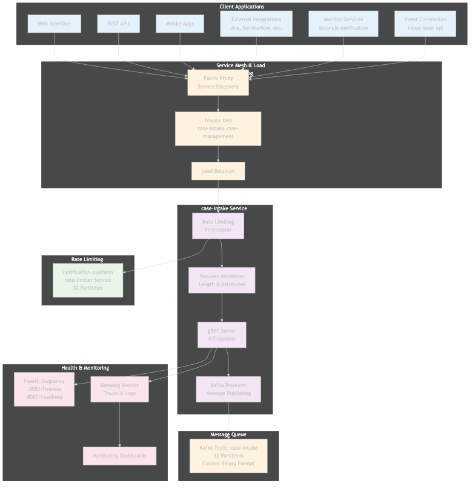
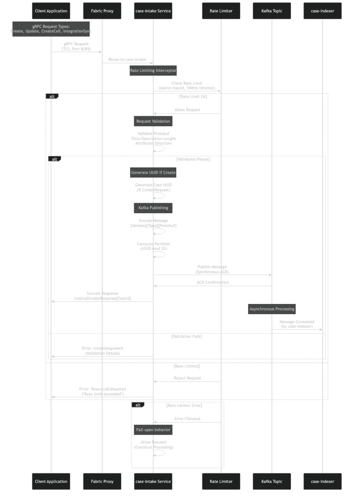
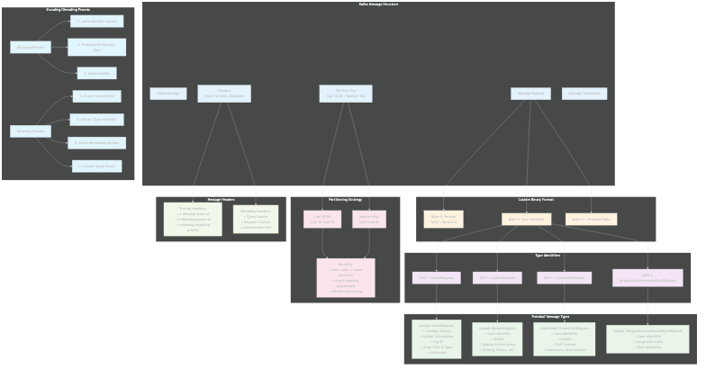
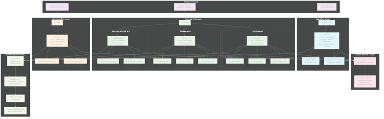

# Case-Intake Service Technical Report

## Executive Summary

The Case-Intake service is a high-performance **gRPC command gateway** in Datadog's case management domain that serves as the primary entry point for all case management operations. It validates incoming requests, applies distributed rate limiting, and publishes commands to Kafka for asynchronous processing. The service implements a **fire-and-forget pattern**, providing immediate responses while ensuring reliable event delivery through Kafka's durability guarantees.

## Service Overview

### Primary Functions
1. **gRPC Command Gateway**: Exposes 4 main endpoints for case management operations
2. **Request Validation**: Validates protobuf structure, length limits, and attribute formats
3. **Distributed Rate Limiting**: Prevents system overload using external rate limiting service
4. **Kafka Message Publishing**: Publishes validated commands to partitioned Kafka topic
5. **Immediate Response**: Returns case IDs immediately for fire-and-forget processing

### Key Metrics
- **gRPC Endpoints**: 4 main operations (Create, Update, CreateCell, IntegrationSync)
- **Port**: 8289 (TLS-enabled gRPC)
- **Kafka Topic**: `case-intake` with 32 partitions
- **Deployment**: 1 replica per datacenter with zero-downtime updates
- **Rate Limiting**: 100ms timeout with fail-open behavior

## Architecture Overview

### System Architecture



The case-intake service operates as a command gateway in the service mesh:
- **Client Applications** connect via Fabric service mesh and private DNS
- **Rate Limiting Interceptor** validates request frequency using external service
- **Request Validation** ensures data quality and format compliance
- **Kafka Producer** publishes validated commands with deterministic partitioning
- **Health & Monitoring** provides comprehensive observability

### Request Processing Flow



The processing flow demonstrates the complete request lifecycle:
1. **Client Request** arrives via TLS-encrypted gRPC
2. **Rate Limiting** check with 100ms timeout and fail-open behavior
3. **Request Validation** for structure, length, and attribute compliance
4. **UUID Generation** for CreateRequest operations if not provided
5. **Kafka Publishing** with synchronous acknowledgment
6. **Immediate Response** with case ID for client confirmation

## API Endpoints and Request Handling

### gRPC Service Definition

The service implements the `CaseIntakeServer` interface with 4 main endpoints:

#### 1. Create (`CreateRequest` → `InternalIntakeResponse`)
```protobuf
message CreateRequest {
    string id = 1;                    // Generated UUID if not provided
    uint64 org_id = 2;               // Organization identifier
    Author author = 3;               // Request author
    string creation_source = 4;      // Source identifier
    repeated CreateAction actions = 5; // Case creation actions
}
```

**Processing**:
- Validates protobuf structure using `req.Validate()`
- Generates UUID if `id` field is empty
- Validates title/description length and attributes
- Publishes to Kafka with case ID partitioning

#### 2. Update (`UpdateRequest` → `InternalIntakeResponse`)
```protobuf
message UpdateRequest {
    Identifier identifier = 1;       // Case ID or monitor key
    Author author = 2;              // Request author  
    repeated UpdateAction actions = 3; // Update operations
}
```

**Supported Update Actions**:
- `UpdateTitle`: Title modifications with validation
- `UpdateAttributes`: Attribute changes with validation
- `UpdateStatus`, `UpdatePriority`: Status/priority changes
- `UpdateInsight`: Insight modifications
- `UpdateCustomAttribute`: Custom field updates

#### 3. CreateCell (`CreateCellRequest` → `InternalIntakeResponse`)
```protobuf
message CreateCellRequest {
    Identifier case_identifier = 1;  // Target case
    Author author = 2;              // Request author
    CellContent content = 3;        // Timeline content
    google.protobuf.Timestamp created_at = 4;
}
```

**Usage**: Timeline comments, attachments, and activity logging

#### 4. IntegrationIncrementalSync (`IntegrationIncrementalSyncRequest` → `InternalIntakeResponse`)
```protobuf
message IntegrationIncrementalSyncRequest {
    Identifier identifier = 1;      // Target case
    Author author = 2;             // Request author
    // Integration-specific sync data
}
```

**Usage**: Third-party integration synchronization (Jira, ServiceNow, etc.)

## Message Validation and Routing Logic

### Validation Framework



The validation system provides multi-layer request validation:

#### Protobuf Validation
- **Structural Validation**: `req.Validate()` using generated protobuf validators
- **Required Fields**: Ensures mandatory fields are present
- **Type Safety**: Protobuf type checking and constraints

#### Custom Business Validation
- **Length Limits**: Title/description length using `consul_max_length` tag
- **Attribute Validation**: Custom `case_attributes` validation for metadata
- **Identifier Validation**: Case ID or monitor key requirement for updates

#### Error Responses
```go
// Validation failure
return nil, status.Error(codes.InvalidArgument, err.Error())

// Missing identifier  
return nil, status.Error(codes.InvalidArgument, "identifier case ID or monitor key must be set")
```

### Kafka Message Format

The service uses a **custom binary format** with versioning:

**Message Structure**: `[Version Byte][Type Identifier][Protobuf Data]`

**Format Details**:
```
Byte 0: 0x02 (Version 2 identifier)
Byte 1: Type identifier
  - 0x02 = CreateRequest
  - 0x03 = UpdateRequest  
  - 0x04 = CreateCellRequest
  - 0x05 = IntegrationIncrementalSyncRequest
Bytes 2+: Standard protobuf-encoded message
```

### Partitioning Strategy

**Deterministic Partitioning** ensures event ordering:

#### Case ID Partitioning
```go
partition := caseUUID.ID() % partitionCount  // 32 partitions
```

#### Monitor Key Partitioning  
```go
hash := sha1.Sum([]byte(monitorKey.ToString()))
partition := uint32(binary.BigEndian.Uint64(hash[:8])) % partitionCount
```

**Benefits**:
- Same case always routes to same partition
- Event ordering guaranteed per case
- Parallel processing across different cases
- Load distribution via hash function

## Distributed Rate Limiting

### Rate Limiting Architecture

The service implements **distributed rate limiting** using the notification-platform service:

#### Configuration
- **Service**: `notification-platform/rate-limiter`
- **Partitions**: 32 partitions with consistent hashing
- **Timeout**: 100ms maximum for rate limit checks
- **Strategy**: Fail-open (allows requests if rate limiter errors)

#### Rate Limiting Process
1. **Key Generation**: `source:{source_name}` aggregation key
2. **Partition Selection**: MMH3 hash-based partition routing
3. **Increment Call**: gRPC call to increment request counter
4. **Limit Evaluation**: Compare current count against configured thresholds
5. **Response**: Allow or reject based on limit status

#### Error Handling
```go
// Rate limit exceeded
return status.Error(codes.ResourceExhausted, "Rate limit exceeded for source")

// Rate limiter service error (fail-open)
log.Warn("Rate limiter error, allowing request", log.RichError(err))
// Continue processing...
```

### Rate Limiting Interceptor

The `RateLimitingInterceptor` provides:
- **Metadata Extraction**: Org ID, source, method from gRPC context
- **Comprehensive Metrics**: Pass/reject/error rates by source and method
- **Request Context**: Rich logging with command type and author information
- **Graceful Degradation**: Continues processing if rate limiter unavailable

## Datacenter Deployment Strategy

### Multi-Environment Deployment



The service deploys across three environments with different strategies:

#### Environment Configuration

**1. Staging Environment**
- **Datacenter**: `staging-full-site`
- **Strategy**: `dangerous_everything_parallel` (simultaneous deployment)
- **Schedule**: Monday 5:00 AM
- **Features**: Dynamic Instrumentation enabled
- **Purpose**: Integration testing and validation

**2. Production Environment**
- **Datacenters**: `prod-site` (US1, EU1, US3, US5, AP1)
- **Strategy**: `delta` (sequential DC-by-DC deployment)
- **Schedule**: Monday 9:30 AM  
- **Cross-DC Routes**: US1↔AP1, EU1↔US1 for redundancy

**3. Government Environment**
- **Datacenter**: `fed-site`
- **Strategy**: `delta` (sequential deployment)
- **Schedule**: Wednesday 9:30 AM
- **Compliance**: FIPS-compliant container images (`caseintakefips`)

#### Resource Allocation

**Standard Configuration**:
```yaml
resources:
  requests:
    cpu: 1 core
    memory: 1Gi
  limits:
    cpu: 1 core  
    memory: 2Gi
replicas: 1  # Per datacenter
```

**Rolling Update Strategy**:
- `maxUnavailable: 0` (zero-downtime deployments)
- `maxSurge: 1` (temporary extra pod during updates)
- `minReadySeconds: 60` (stabilization period)

### Service Discovery and Networking

#### Service Configuration
- **DNS Name**: `case-intake.case-management.all-clusters.local-dc.fabric.dog`
- **Service Type**: Headless (`clusterIP: None`) for direct pod access
- **Port**: 8289 (gRPC with mandatory TLS)
- **Private DNS**: Enabled for internal service discovery

#### Network Security
**Cilium Network Policies** restrict ingress to approved services:
- `delancie-notification` (Monitor service)
- `inbox-issue-api` (Event Correlation service)
- `event-correlation-relay` (Event Management service)

## Performance and Observability

### Key Metrics Collected

#### Request Metrics
```go
statsd.Incr("case_intake.requests.count", []string{
    fmt.Sprintf("success:%v", err == nil),
    fmt.Sprintf("status_code:%v", getErrorStatusString(err)), 
    fmt.Sprintf("author:%s", req.GetAuthor()),
    fmt.Sprintf("source:%s", source),
    fmt.Sprintf("command:%T", req),
    fmt.Sprintf("org_id:%d", req.OrgId),
}, 1)
```

#### Rate Limiting Metrics
- `case_intake.ingress_rate_limiter.passed` - Requests allowed through
- `case_intake.ingress_rate_limiter.rejected` - Requests blocked by rate limiter
- `case_intake.ingress_rate_limiter.errors` - Rate limiter service errors

#### Client-Side Metrics (SDK)
- `dd.case_intake.client.requests` - Client request counts
- `dd.case_intake.client.errors` - Client-side error rates  
- `dd.case_intake.client.timing` - Client request latency

### Distributed Tracing

The service provides comprehensive tracing:

#### Trace Spans
```go
span, ctx := tracer.StartSpanFromContext(ctx, "case_intake.create",
    tracer.Tag("org_id", req.OrgId),
    tracer.Tag("author", req.GetAuthor()), 
    tracer.Tag("case_id", req.GetId()),
)
```

#### Trace Context Propagation
- **Headers**: Trace context injected into Kafka messages
- **Cross-Service**: Traces continue through case-indexer to backend APIs
- **Error Correlation**: Error information captured in trace spans

### Health Monitoring

#### Health Checks
- **Liveness**: `/liveness` on port 8080 (service running)
- **Readiness**: `/readiness` on port 8080 (ready to accept requests)
- **Probes**: 30s initial delay, 15s period for liveness, 10s for readiness

#### Monitoring Dashboards
- **Staging**: Environment-specific monitoring dashboard
- **Production**: Separate dashboard with production metrics
- **Alerts**: Slack integration for deployment notifications

## Technical Implementation Details

### Core Service Components

#### Main Service Bootstrap (`main.go`)
```go
// Service initialization
producer, err := kafka.NewProducer(cfg)
rateLimitingInterceptor := NewRateLimitingInterceptor(...)
gs, err := grpc.CreateGrpcService(appName, options.port,
    grpc.WithAdditionalInterceptors(rateLimitingInterceptor.UnaryServerInterceptor),
)
server := NewCaseIntakeServer(producer)
intakepb.RegisterCaseIntakeServer(gs.GetServer(), server)
```

#### gRPC Server Implementation (`server.go`)
```go
func (svr *CaseIntakeServer) Create(ctx context.Context, req *casepb.CreateRequest) (*intakepb.InternalIntakeResponse, error) {
    // 1. Protobuf validation
    if err := req.Validate(); err != nil {
        return nil, status.Error(codes.InvalidArgument, err.Error())
    }
    
    // 2. UUID generation
    if req.GetId() == "" {
        req.Id = uuid.NewString()
    }
    
    // 3. Business validation  
    if err = validation.ValidateCreateRequest(ctx, req); err != nil {
        return nil, err
    }
    
    // 4. Kafka publishing
    if err = svr.producer.Produce(ctx, req, casepb.NewIDIdentifier(req.GetOrgId(), req.GetId())); err != nil {
        return nil, status.Error(codes.Internal, err.Error())
    }
    
    return &intakepb.InternalIntakeResponse{CaseId: req.Id}, nil
}
```

#### Kafka Producer (`kafka/producer.go`)
```go
func (p *Producer) Produce(ctx context.Context, req proto.Message, identifier *casepb.Identifier) error {
    // 1. Message encoding
    payload, err := intake.EncodeIntakeRequest(ctx, req)
    
    // 2. Partition computation  
    partition, err := p.computePartition(identifier)
    
    // 3. Synchronous publish with tracing
    return p.kproducer.Produce(&kafka.Message{
        TopicPartition: kafka.TopicPartition{
            Topic:     p.topic,
            Partition: int32(partition),
        },
        Value: payload,
        Headers: []kafka.Header{
            {Key: "trace-context", Value: traceBytes},
        },
    }, nil)
}
```

### Configuration Management

#### Environment-Specific Configuration
- **Consul Integration**: Dynamic configuration via consul templates
- **Database Settings**: Connection pooling and timeout configuration
- **Kafka Settings**: Topic, partition count, producer timeouts
- **Rate Limiter**: Service URLs and partition configuration

#### Security Configuration
- **TLS**: Mandatory TLS for all gRPC communications
- **Service Mesh**: Fabric proxy integration for service-to-service security
- **Network Policies**: Ingress restrictions via Cilium
- **FIPS Compliance**: Specialized images for government deployments

## Integration Architecture

### Upstream Integrations

#### Client Libraries
The service provides client SDKs for easy integration:

```go
// Client configuration
client, err := intake.NewClientWithTLS("case-intake.case-management...:8289")

// Request execution with metrics
response, err := client.Create(ctx, &casepb.CreateRequest{
    OrgId: orgID,
    Author: author,
    Actions: createActions,
})
```

#### Service Sources
- **Web Interface**: Case management UI operations
- **Mobile Applications**: Native mobile case creation/updates
- **REST APIs**: External API integrations
- **Monitor Services**: Automated case creation from alerts
- **Event Correlation**: Integration with event management systems

### Downstream Dependencies

#### Message Queue
- **Kafka Topic**: `case-intake` with 32 partitions
- **Consumer**: case-indexer service processes published commands
- **Durability**: Kafka replication ensures message durability
- **Ordering**: Partition-based ordering guarantees per case

#### External Services
- **Rate Limiter**: notification-platform rate limiting service
- **Consul**: Configuration management and service discovery
- **Datadog**: Metrics, traces, and logging infrastructure

## Security and Compliance

### Security Features
- **Transport Security**: TLS 1.3 for all gRPC communications
- **Authentication**: Service mesh authentication via fabric
- **Authorization**: Request source validation and org ID verification
- **Network Isolation**: Cilium network policies restrict access

### Compliance
- **FIPS 140-2**: Government deployments use FIPS-compliant cryptography
- **Data Privacy**: No sensitive data logging or metrics
- **Audit Trail**: Complete request tracing and logging
- **Access Control**: Network policies enforce least privilege access

## Error Handling and Reliability

### Error Classification

#### Client Errors (4xx)
```go
// Invalid request structure
codes.InvalidArgument: "Validation failed: title too long"

// Missing required fields
codes.InvalidArgument: "identifier case ID or monitor key must be set"

// Rate limit exceeded
codes.ResourceExhausted: "Rate limit exceeded for source"
```

#### Server Errors (5xx)
```go
// Kafka publishing failure
codes.Internal: "Failed to publish message to Kafka"

// Service unavailable  
codes.Unavailable: "Service temporarily unavailable"
```

### Reliability Patterns

#### Fail-Open Rate Limiting
- Rate limiter errors don't block requests
- Graceful degradation maintains service availability
- Comprehensive error logging for debugging

#### Synchronous Kafka Publishing
- Waits for Kafka acknowledgment before responding
- Ensures message durability before client confirmation
- Prevents lost messages due to service failures

#### Zero-Downtime Deployments
- Rolling update strategy with `maxUnavailable: 0`
- Health check validation before traffic routing
- Graceful shutdown with connection draining

## Future Considerations

### Scalability Enhancements
- **Horizontal Scaling**: Multiple replicas with load balancing
- **Partition Optimization**: Dynamic partition count adjustment
- **Regional Deployment**: Multi-region for reduced latency

### Feature Extensions
- **Request Batching**: Batch multiple operations in single request
- **Async Response**: WebSocket or long-polling for status updates
- **Enhanced Validation**: Schema evolution and backward compatibility

### Operational Improvements
- **Circuit Breakers**: Prevent cascade failures to dependencies
- **Request Replay**: Dead letter queues for failed processing
- **Performance Optimization**: Connection pooling and request caching

## Conclusion

The Case-Intake service serves as a robust, high-performance command gateway for Datadog's case management system. Its architecture provides:

### Key Strengths
- **High Throughput**: Immediate response with fire-and-forget processing
- **Reliability**: Synchronous Kafka publishing ensures message durability
- **Scalability**: Partition-based load distribution and horizontal scaling
- **Observability**: Comprehensive metrics, tracing, and logging
- **Security**: TLS encryption, network policies, and FIPS compliance

### Production Benefits
- **Developer Experience**: Simple gRPC interface with generated clients
- **Operational Excellence**: Zero-downtime deployments and health monitoring
- **System Resilience**: Fail-open rate limiting and graceful error handling
- **Compliance Ready**: FIPS-compliant deployments for government requirements

The case-intake service demonstrates enterprise-grade microservice architecture with proper separation of concerns, comprehensive error handling, and production-ready patterns for distributed systems at scale.

---

*This report provides a comprehensive technical overview of the Case-Intake service, its request processing architecture, and its deployment strategy across Datadog's global case management infrastructure.*